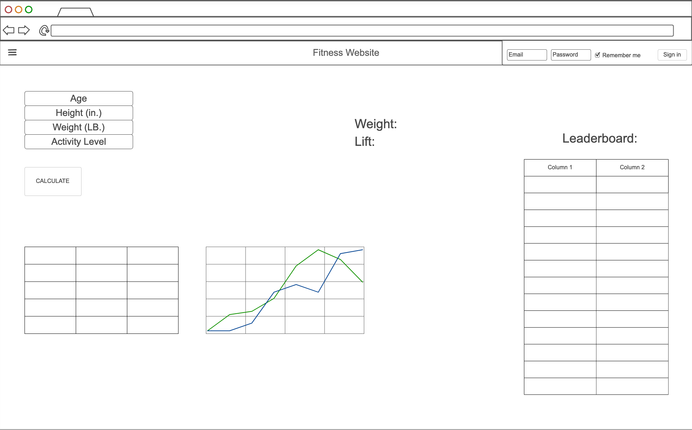

# Startup - Fitness Website

## Specification Deliverable

### Elevator pitch

Tired of guessing how many calories to eat or whether your workouts are actually building strength? My website is an all-in-one fitness hub that takes the guesswork out of achieving your goals. Whether you want to lose weight, gain muscle, or crush personal records, my platform calculates your exact calorie needs gives you the relevant information to do so. Track every lift, log your weights, and watch your progress soar. See your strength grow week after week and stay motivated with a roadmap to success.

### Design

### Key features

- Has a secure login over HTTPS
- Personalized calorie calculator for weight loss/gain goals  
- Strength training tracker with exercise database (track lifts, weights, sets/reps)  
- Progress dashboard with charts/graphs for calories and weight changes
- Personal Record tracking
- Leaderboard data of other users 
- Storage for all user progress and history  
- Ability to enter in data
- Display calculated data

### Technologies

I am going to use the required technologies in the following ways:

- **HTML** - Uses correct HTML structure for application. Two HTML pages for the login page and dashboard.
- **CSS** - Clean layouts for workout logs, charts, and forms. Styling that looks good on different screen sizes, uses good whitespace, color choice and contrast.
- **React** 
  - Calorie calculator form  
  - Progress dashboard with charts  
  - Routing between pages  
- **Service** - Backend service with endpoints for:
  - Login
  - Calculating daily calorie goals  
  - Saving/loading workout and weight data  
  - Getting progress history 
- **DB/Login** - Store users, workout logs (exercise, weight, reps) in database. Register and login users. User credentials securely stored in the database.
- **WebSocket** - Instant updates to charts when new data is logged and is shown to other users if permitted.

### HTML deliverable

For this deliverable I built out the structure of my application using HTML.

- **HTML pages** - Two HTML page that will let you login and get information from the dashboard.
- **Links** - The login and dashboard page both have links to each other to navigate the site. Also included a link to my GitHub repo in the footers.
- **Text** - Instructions to login are on the login page. Additionally, a lot of text was needed on the dashboard page to guide the user and provide necessary information.
- **Images** - Included images to both pages' headers.
- **DB/Login** - Input box and submit button for login. Input box and 'calculate' button for calculator. Added input box and dropdown for Personal Records that pulls data from the database. The voting choices represent data pulled from the database.
- **WebSocket** - The leaderboard section shows real-time data from accounts